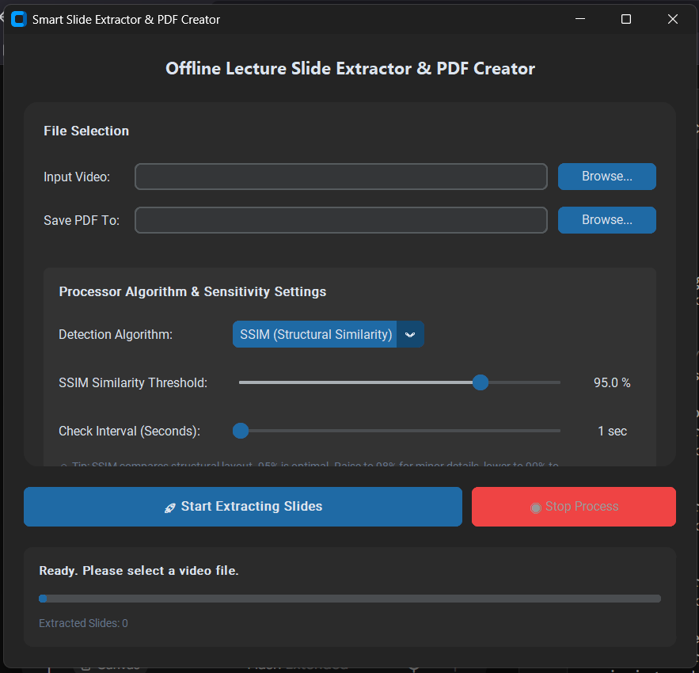

# **🚀 Smart Slide Extractor \& PDF Creator**

  

A professional, modern, and fully offline desktop application built in Python to automatically extract unique presentation slides from lecture videos and compile them into a high-quality, lightweight PDF document.

## **🌟 Features**

* **Dual Detection Algorithms:**

  * **SSIM (Structural Similarity Index):** Analyzes layout and structural changes using advanced image processing. Highly accurate, ignores minor noise and camera shakes.
  * **Pixel Difference (Absolute Diff):** Compares raw pixel modifications. Fast and highly customizable.
* **Modern GUI Design:** Built with CustomTkinter featuring a clean, responsive card-based layout with automatic Dark/Light system theme integration.
* **Asynchronous Multi-Threading:** Prevents the UI from freezing (Not Responding) during heavy video processing operations.
* **Super-Fast PDF Compilation:** Powered by PyMuPDF (Fitz) to merge and compress images into a single PDF in seconds without quality loss.
* **Edge-Case Resilience:**

  * Standardized extended UNC path converter to handle **Windows Long Path Limits (>260 characters)**.
  * Unicode I/O bypass to fully support directories/files named in non-ASCII languages (e.g., Persian, Arabic, Chinese).
  * Dynamic auto-wrapping for high-DPI displays.
* **Robust Error Management:** Includes an explicit error coding system (ERR\_VAL\_101, ERR\_CV\_201, etc.) for seamless troubleshooting.

## **🛠️ Requirements \& Installation**

Before running the application, make sure you have Python 3.8+ installed.  
Install the required dependencies using pip:  
pip install customtkinter opencv-python pymupdf scikit-image numpy

## **🚀 How to Use**

1. Run the script:  
python slide\_extractor\_gui.py
2. **Select Video:** Click **Browse** next to *Input Video* and choose your lecture recording.
3. **Select Save Destination:** The app will automatically suggest a PDF path in the same folder, but you can change it by clicking **Browse** next to *Save PDF To*.
4. **Choose Algorithm:** Select either **SSIM** (Recommended for slides) or **Pixel Difference**.
5. **Adjust Sensitivity \& Interval:**

   * **SSIM:** 95% is the sweet spot. Higher values are more sensitive.
   * **Check Interval:** Tells the app how many seconds to skip before checking the next frame (e.g., 1 sec).
6. Click **🚀 Start Extracting Slides** and watch the live progress bar!

## **❌ System Error Codes Reference**

If something goes wrong, the app will trigger an error window with one of the following codes:

|Error Code|Category|Description|
|-|-|-|
|ERR\_VAL\_101|Validation|Input video path is empty or file does not exist.|
|ERR\_VAL\_102|Validation|Output PDF path is not specified.|
|ERR\_CV\_201|OpenCV|Decoder failed to open the selected video.|
|ERR\_CV\_202|OpenCV|Invalid metadata (FPS or total frames is zero).|
|ERR\_IO\_301|File I/O|Failed to create the unique temporary workspace.|
|ERR\_IO\_302|File I/O|Failed to clean up the temporary directory after process completion.|
|ERR\_PROC\_401|Processing|Unexpected exception occurred during frame scanning.|
|ERR\_EMPTY\_501|Algorithm|No unique slides were captured (Sensitivity threshold is too high).|
|ERR\_PDF\_601|Document Creator|PyMuPDF compilation or document save failed.|
|ERR\_DEP\_701|Dependency|Required Python packages are missing on the system.|

## **📄 License**

This project is licensed under the MIT License - see the [LICENSE](LICENSE) file for details.

